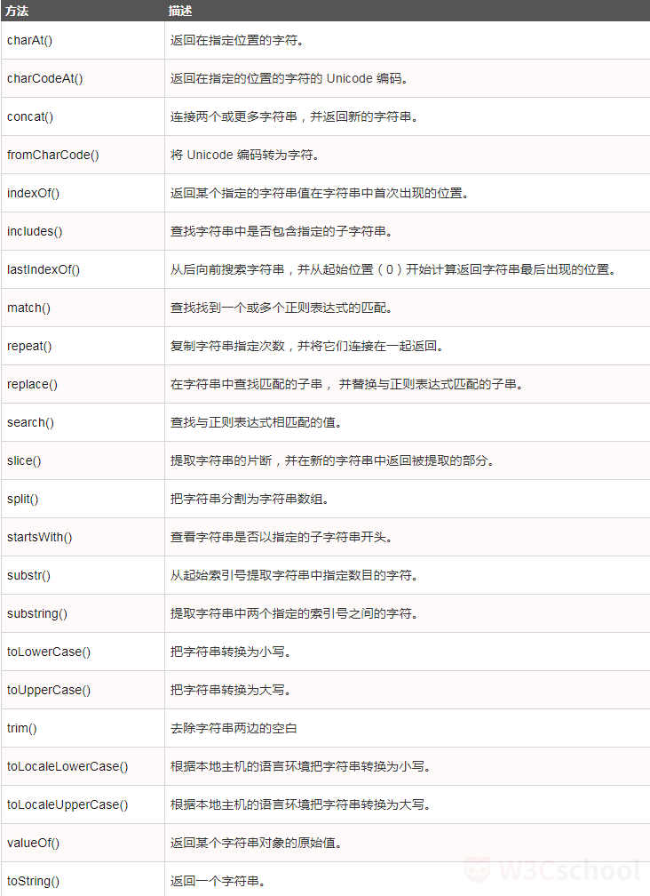

# JavaScript核心对象

## String对象

> String对象用于处理文本（字符串）。

```JavaScript
var txt = new String("string"); // 即 var txt = "string"; 
```

### String对象方法

\


### JavaScript正则表达式

\![0007]\(img/0007.gif)


## Window对象

> Window对象表示浏览器中打开的窗口。
>
> 如果文档中包含框架（\<frame>或\<iframe>标签），浏览器会为HTML文档创建一个window对象，并为每个框架创建一个额外的window对象。
>
> window作为全局变量，代表了脚本正在运行的窗口，暴露给JavaScript代码。

### Window对象属性

\![0008]\(img/0008.png)


### Windows对象方法

\![0009]\(img/0009.png)


#### open()方法

> open()方法用于打开一个新的浏览器窗口或查找一个已命名的窗口。
>
> `window.open(URL, name, specs, replace)`
>
> \![0010]\(img/0010.png)
>
> \![0011]\(img/0011.png)
>
> 
>
> 
>
> ```JavaScript
> // 在新浏览器窗口中打开www.w3cschool.cn
> function open_win() {
>     window.open("http://www.w3cschool.cn"); 
> }
> ```
>
> ```JavaScript
> // 在新浏览器窗口中打开空白页
> function openWin() {
>     myWindow = window.open("", "", "width=200, height=100"); 
>     myWindow.document.write("<p>It's my window!</p>"); 
>     myWindow.focus(); 
> }
> ```

#### setTimeout()方法

> setTimeout()方法用于在指定的毫秒数后调用函数或计算表达式。【使用clearTimeout()方法来阻止函数的执行。
>
> 如果想重复执行可以使用setInterval()方法；使用clearInterval()方法来阻止函数的执行。

```JavaScript
setTimeout(function(){alert("Hello World!"); }, 3000); 
```

```javascript
var myVar; 

function myFunction() {
    myVar = setTimeout(function(){alert("Hello");}, 3000); 
}

function myStopFunction() {
    clearTimeout(myVar); 
}
```

## JSON

> JSON(**J**ava**S**cript **O**bject **N**otation)是用于存储和传输数据的格式。
>
> JSON通常用于服务端向网页传递数据。
>
> JSON是一种轻量级的数据交换格式。

### JSON实例

```JSON
{"sites": [
    {"name": "W3Cschool", "url": "www.w3cschool.cn"}, 
    {"name": "Google", "url": "www.google.com"}, 
    {"name": "Baidu", "url": "www.baidu.com"}
]}
```

### JSON.parse()方法

> JSON.parse()方法用于将一个JSON字符串转换为对象。
>
> 语法：`JSON.parse(text[, reviver])`
>
> - text：【必需】一个有效的JSON字符串。
> - reviver：【可选】一个转换结果的函数，将为对象的每个成员调用此函数。

```javascript
var text = '{"sites": [
    {"name": "W3Cschool", "url": "www.w3cschool.cn"}, 
    {"name": "Google", "url": "www.google.com"}, 
    {"name": "Baidu", "url": "www.baidu.com"}
]}'; 
obj = JSON.parse(text); 
document.getElementById("demo").innerHTML = obj.sites[1].name + " " + obj.sites[1].url; 
```

```javascript
JSON.parse('{"p": 5, "s": 1.5, "t": -3}', function(k, v){
    if(k === "") return v; // 如果到了最顶层，则直接返回属性值
    return v*2; 
}); // {"p": 10, "s": 3, "t": -6}
```

> 如果带reviver函数遍历属性的顺序是**从内向外**的。

```javascript
JSON.parse('{"1": 1, "2": 2, "3": {"4":4, "5": {"6": 6}}}', function(k, v) {
    console.log(k); // 将属性名输出到控制台
    return v; 
})
// 1 // 2 // 4 // 6 // 5 // 3 // ""
```

> JSON.parse()不允许用逗号作为结尾。

```javascript
JSON.parse("[1, 2, 3, 4, ]"); 
JSON.parse('{"foo": 1, }'); 
```

### JSON.stringify()方法

> JSON.stringify()方法用于将JavaScript值转为JSON字符串。
>
> 语法：`JSON.stringify(value[, replacer[, space]])`
>
> - value：【必需】要转换的JavaScript值（通常为对象或数组）
> - replacer：【可选】用于转换结果的函数或数组。如果replacer为函数，则JSON.stringify将调用该函数，并传入每个成员的键和值。如果该函数返回undefined，则意味着排除该成员。根对象的键是一个空字符串：""。如果replacer是一个数组，则仅转换该数组中具有对应键值的成员。成员的转换顺序与键在数组中的顺序一样。
> - space：【可选】文本添加缩进、空格和换行符，如果space是一个数字，则返回值文本在每个级别缩进指定数目的空格，如果space大于10，则文本缩进10个空格。space也可以使用非数字，如：\t。

```javascript
var str = {"name": "W3Cschool", "site": "http://www.w3cschool.cn"}; 
str_pretty1 = JSON.stringify(str); 
document.write("只有一个参数：<br/><pre>" + str_pretty1 + "</pre><br/>"); 
str_pretty2 = JSON.stringify(str, null, 4)
document.write("使用参数：<br/><pre>" + str_pretty1 + "</pre><br/>"); 
// pre用于格式输出
```

## Math对象

> Math对象提供多种算数值类型和函数。

### Math对象属性

\![0012]\(img/0012.png "Math对象属性")


### Math对象方法

\![0013]\(img/0013.png "Math对象方法")


> 注意：与很多其他语言中的round()函数不同的是，Math.round()并不总是舍到远离0的方向，如：`x = Math.round(-20.5); //-20`。

## 时间对象

### setInterval()方法

> setInterval()方法调用函数或以指定的间隔（以毫秒为单位）来计算表达式。
>
> 它将持续调用该函数，直到调用clearInterval()或窗口关闭。

```javascript
function myAlert() {
    alert("Hello World!"); 
}
setInterval(myAlert, 3000); //每隔3秒执行一次myAlert
```

### Date对象

> 日期由**年、月、日、时、分、秒和毫秒**组成。
>
> 使用new Date()，将创建一个存储当前日期和时间的日期对象。

```javascript
var d = new Date(); // d 存储了当前的日期和时间
```

> 初始化日期的其他方法允许从指定的日期和时间创建新的日期对象。
>
> JavaScript日期以**1970年01月01日00:00:00**世界时（UTC）计算。一天包含**86400000**毫秒。
>
> JavaScript计数**从0到11，依次代表1月到12月**。

```javascript
new Date(milliseconds); // 毫秒
// Fri Jan 02 1970 08:00:00 GMT+0800 (中国标准时间)
var d1 = new Date(86400000); 

new Date(dateString); // 日期字符串
// Thu Oct 19 2017 15:56:00 GMT+0800 (中国标准时间)
var d2 = new Date("October 19, 2017 15:56:00"); 

new Date(year, month, day, hours, minutes, seconds, milliseconds); // 年, 月, 日, 时, 分, 秒, 毫秒
// Sat Jun 11 1988 11:42:00 GMT+0800 (中国标准时间)
var d3 = new Date(88, 5, 11, 11, 42, 00); 
```

### Date方法

\![0014]\(img/0014.png "Date方法")

\![0015]\(img/0015.png "Date方法")

\![0016]\(img/0016.png "Date方法")


