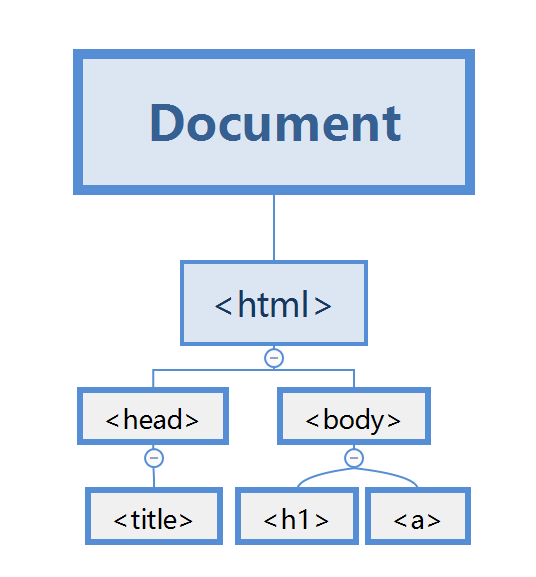

# DOM

## 动画

```html
<style>
    #container {
        width: 200px; 
        height: 200px; 
        background: green; 
        position: relative; 
    }
    #box {
        width: 30px; 
        height: 30px; 
        background: red; 
        position: absolute; 
    }
    /* 容器是相对的，盒子是绝对的。
    这将允许我们创建相对于容器的动画。 */
</style>
<div id="container">
    <div id="box"></div>
</div>
```

<div style="width: 200px; height: 200px; background: green; position: relative; "><div style="width: 30px; height: 30px; background: red; position: absolute; "></div></div>

```javascript
// 定义开始的位置
var pos = 0; 
// 获取box元素
var box = document.getElementById("box"); 
// 使用setInterval()方法反复调用move()函数
var t = setInterval(move, 10); 
// 定义一个move()函数，以改变框的位置
function move() {
    if (pos >= 170) {
        clearInterval(t); 
    }
    else {
    	pos += 1; 
    	box.style.left = pos + "px"; 
	}
}
```

## DOM

> 通过HTML DOM，JavaScript可以访问HTML文档的所有元素。
>
> 当网页被加载时，浏览器会创建页面的文档对象模型（**D**ocument **O**bject **M**odel），HTML DOM模型被构造为对象的树：【\<html>有两个子节点\<head>和\<body>，后两者互为兄弟节点】
>
> \
>
> 
>
> 通过可编程的对象模型，JavaScript获得了足够的能力来创建动态的HTML
>
> - JavaScript能改变页面中的所有HTML元素
> - JavaScript能改变页面中的所有HTML属性
> - JavaScript能改变页面中的所有CSS样式
> - JavaScript能对页面中的所有事件做出反应

## 选择元素

> document对象有三种方法最常用于选择HTML元素：

```javascript
// 通过 id 找元素，返回单一元素
document.getElementById(id)
// 通过 类 找元素，返回数组
document.getElementByClassName(name)
// 通过 标签 找元素，返回数组
document.getElementByTagName(name)
```

> DOM中的每个元素都有一组属性和方法，它们提供有关它们在DOM中的关系的信息：
>
> - element.childNodes：返回一个元素的子节点的数组
> - element.firstChild：返回元素的第一个子节点
> - element.lastChild：返回元素的最后一个子节点
> - element.hasChildNodes：如果元素有任何子节点，则返回true，否则为false
> - element.nextSibling：返回相同树级别的下一个兄弟节点
> - element.previousSibling：返回相同树级别的上一个兄弟节点
> - element.parentNode：返回元素的父节点

```html
<html>
    <body>
        <div id="demo">
            <p>
                some text
            </p>
            <p>
                another text
            </p>
        </div>
        <script>
        	var a = document.getElementById("demo"); 
            var arr = a.childNodes; 
            for (var x = 0; x < arr.length; x++) {
                arr[x].innerHTML = "new text"; 
            }
        </script>
    </body>
</html>
```

## 改变属性

> JavaScript可以更改元素的所有属性。

```html
<!-- 更改图像的src属性 -->

<script>
	var el = document.getElementById("myImg"); 
    el.src = "https://www.w3cschool.cn/attachments/cover/cover_html.png"; 
</script>
```

```html
<!-- 更改链接的href属性 -->
<a href="http://www.baidu.com">百度</a>
<script>
	var el = document.getElementByTagName("a"); 
    el[0].href = "https://www.w3cschool.cn"; 
    el[0].innerHTML = "W3Cschool"; 
</script>
```

> 可以使用元素的style对象来访问所有的样式属性。【特别注意：我们不能在属性名称中使用破折号（-），应用驼峰写法来替换。如：background-color应换为backgroundColor】

```html
<div id="demo" style="width: 200px">
    some text
</div>
<script>
	var x = document.getElementById("demo"); 
    x.style.color = "#6600ff"; 
    x.style.width = "100px"; 
</script>
```

## 添加和移除元素

> 使用以下方法创建新节点：
>
> - element.cloneNode()：克隆元素并返回结果节点
> - document.createElement(element)：创建一个新的元素节点
> - document.createTextNode(text)：创建一个新的文本节点【如：`var node = document.createTextNode("some new text"); `，但它不会出现在文档中，直到我们使用如下方法将其附加到现有元素：
>   - element.appendChild(newNode)将一个新的子节点添加到元素作为最后一个子节点
>   - element.insertBefore(node1, node2)在节点2之前插入节点1作为element的子节点

```html
<div id="demo">
    some text
</div>
<script>
	// create a paraagraph
    var p = document.createElement("p"); 
    var node = document.createTextNode("another text"); 
    // append node to p
    p.appendChild(node); 
    
    var div = document.getElementById("demo"); 
    // append p to div
    div.appendChild(p); 
</script>
```

> 要移除HTML元素，必须选择元素的父节点并使用removeChild(node)方法。

```html
<div id="demo">
    <p id="p1">
        a paragraph
    </p>
    <p id="p2">
        another paragraph
    </p>
</div>
<script>
	var parent = document.getElementById("demo"); 
    var child = document.getElementById("p1"); 
    parent.removeChild(child); 
    /* 或者使用如下方法 
    var child = document.getElementById("p1"); 
    child.parentNode.removeChild(child); */
</script>
```

> 要替换HTML元素，使用element.replaceChild(newNode, oldNode)方法。

```html
<div id="demo">
    <p id="p1">
        a paragraph
    </p>
    <p id="p2">
        another paragraph
    </p>
</div>
<script>
	var p = document.createElement("p"); 
    var node = document.createTextNode("new paragraph"); 
    p.appendChild(node); 
    
    var parent = document.getElementById("demo"); 
    var child = document.getElementById("p1"); 
    parent.replaceChild(p, child); 
</script>
```

