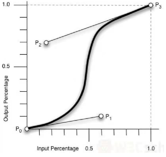

# CSS3过渡与转换

## 转换

> CSS3转换（transition）允许我们在限定的时间内从一个属性值**转换**到另一个属性值。
>
> - transition-property：指定要转换的属性。
> - transition-duration：指定转换发生的持续时间。（为0时无过渡效果）
> - transition-timing-function：指定转换的速度在其持续时间内如何变化。
> - transition-delay：制定过渡效果的延迟（以秒为单位）。
>
> 默认值为`transition: all 0 ease 0; `

### transition-property

```CSS
div {
    width: 100px; 
    height: 100px; 
    background: red; 
    color: #fff; 
    transition: width 3s; 
}
div:hover {
    width: 250px; 
}
```

### transition-timing-function

> - ease：【默认】先缓慢后加速
>
> - ease-in：缓步开始，然后加速，再突然停止
>
> - ease-out：快速启动，减速停止
>
> - ease-in-out：类似于ease，但加减速稍微不同
>
> - linear：匀速变换
>
> - \
>
>   cubic-bezier()函数：定义一个贝赛尔曲线（Cubic Bezier）。
>
>   贝塞尔曲线由四个点P0，P1，P2，P3定义。
>
>   取值范围0~1之间。
>
>   `transition-timing-function: cubic-bezier(0, 0, 1, 1); `

## transform

> CSS3中transform允许我们**翻转**，**旋转**，**缩放**和**倾斜**元素。

### transform-origin

> transform-origin属性允许我们更改**已转换元素**的位置。该属性的默认值是50% 50%，对应于元素的中间。

```CSS
div:first-child {
    position: relative; 
    height: 100px; 
    width: 100px; 
    margin: 30px; 
    padding: 10px; 
    border: 1px solid black; 
}
div:nth-child(2) {
    position: absolute; 
    padding: 50px; 
    border: 1px solid white; 
    background-color: #8bc34a; 
    transform: rotate(15deg); 
    transform-origin: 30% 80%; 
}
```

<div>
    <div style="position: relative; height: 100px; width: 100px; padding: 10px; border: 1px solid black; display: inline-block; ">
	</div>
	<div style="position: relative; padding: 50px; margin: -100px; border: 1px solid white; background-color: #8bc34a; transform: rotate(15deg); transform-origin: 30% 80%; display: inline-block; ">
w3cschool
    </div>
</div>


### rotate

> rotate()方法旋转当前的绘图。
>
> 旋转只会影响到旋转完成后的绘图。

```CSS
div {
    width: 200px; 
    height: 100px; 
    margin-top: 30px; 
    background-color: #32cd32; 
    transform: rotate(15deg); 
}
```

<div style="width: 200px; 
    height: 100px; 
    margin-top: 30px; 
    background-color: #32cd32; 
    transform: rotate(15deg); ">
    w3cschool
</div>

### translate

> translate()方法平移当前的绘图。

```CSS
div {
    padding: 50px; 
    position: absolute; 
    background-color: red; 
    transform: translate(120px, 60px); 
}
```

<div style="padding: 50px; 
    position: absolute; 
    background-color: red; 
    transform: translate(120px, 60px); ">
    w3cschool
</div>


### skew

> skew()方法通过给元素设置X轴和Y轴的倾斜角度值来实现倾斜。

```CSS
div {
    padding: 50px; 
    position: absolute; 
    background-color: blue; 
    transform: skew(45deg); 
    -webkit-transform: skew(45deg); 
}
```

<div style="padding: 50px; 
    position: absolute; 
    background-color: blue; 
    transform: skew(45deg); 
    -webkit-transform: skew(45deg); ">
    w3cschool
</div>


### scale

> scale()方法用于缩放

> 多重transform间用空格隔开。

## 动画

### @keyframes规则

```CSS
div {
    width: 100px; 
    height: 100px; 
    background-color: red; 
    animation-name: example; 
    animation-duration: 1s; 
}
@keyframes example {
    /* 也可以使用from（0%）和to（100%）关键字 */
    0% {background-color: red; }
    50% {background-color: yellow; }
    70% {background-color: blue; }
    100% {background-color: green; }
}
```

### 动画属性

> animation-timing-function指定动画的速度曲线：
>
> - ease：【默认】慢启动，然后快速，再慢慢结束。
> - linear：匀速。
> - ease-in：慢启动。
> - ease-out：慢结束。
> - ease-in-out：慢启动、慢结束。
> - cubic-bezier(n, n, n, n)：n取值为0~1。
>
> animation-delay属性定义动画何时开始。
>
> animation-iteration-count属性指定动画重复次数。（无限次为infinite）
>
> animation-direction属性指定如何应用关键帧：
>
> - normal：【默认】从0%到100%前进。
> - reverse：从100%到0%。
> - alternate：先向前，后向后，再向前。
> - alternate reverse：先向后，后向前，再向后。

> `animation: animation-name animation-duration animation-timing-function animation-dalay animation-iteration-count animation-direction; `

## 3D转换

> `transform: translate3d(x, y, z) rotate3d(x_deg, y_deg, z_deg) `
>
> - `translate3d(x, y, z)`等价于`translateX(x) translateY(y) translateZ(z)`
> - `rotate3d(x, y, z)`等价于`rotateX(x) rotateY(y) rotateZ(z)`
>
> prespective定义如何渲染3D场景的深度。

```CSS
div.empty-div {
    position: relative; 
    height: 200px; 
    width: 200px; 
    margin: 30px; 
    padding: 10px; 
    border: 1px solid black; 
    perspective: 100px; 
    -webkit-perspective: 100px; 
}
div.red-div {
    padding: 60px; 
    position: absolute; 
    background-color: red; 
    border: 1px solid white; 
    transform: rotateX(45deg); 
    -webkit-transform: rotateX(45deg); 
}
```

<div style="position: relative; height: 200px; width: 200px; margin: 30px; padding: 10px; border: 1px solid black; perspective: 100px; -webkit-perspective: 100px; ">
    <div style="padding: 60px; position: absolute; background-color: red; border: 1px solid white; transform: rotateX(45deg); -webkit-transform: rotateX(45deg); "></div></div>

